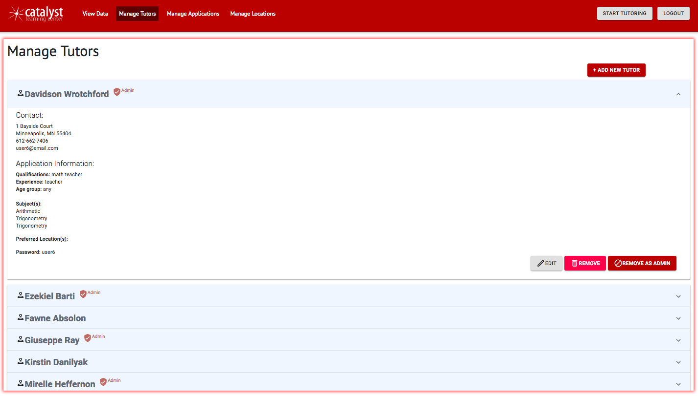
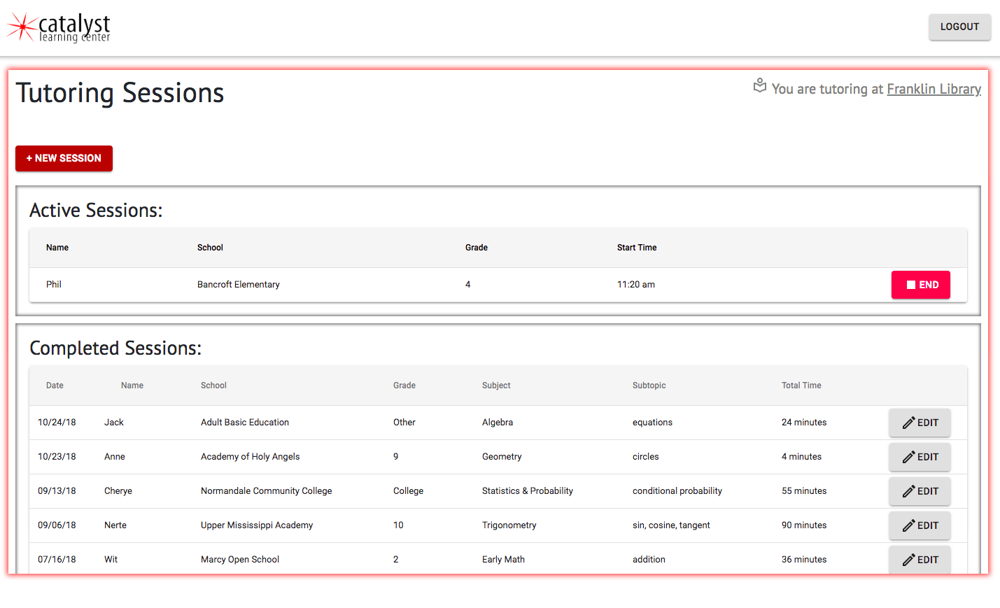
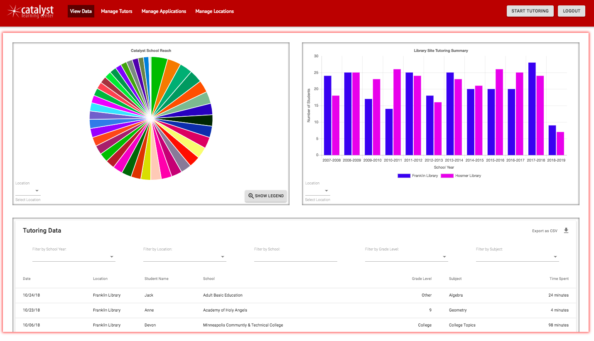
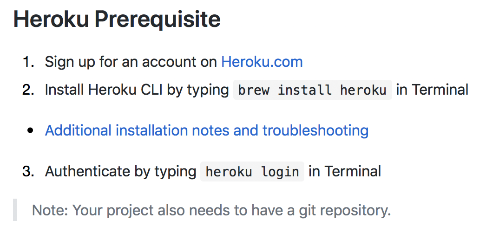
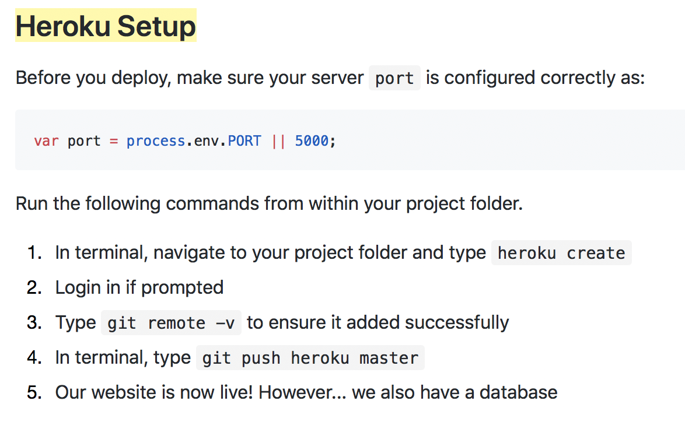
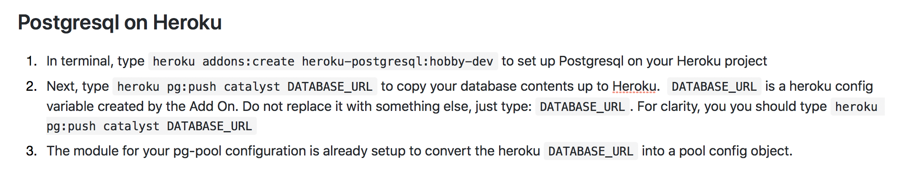
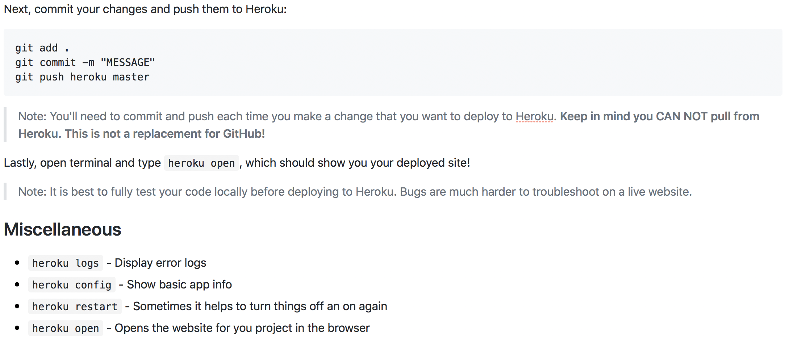
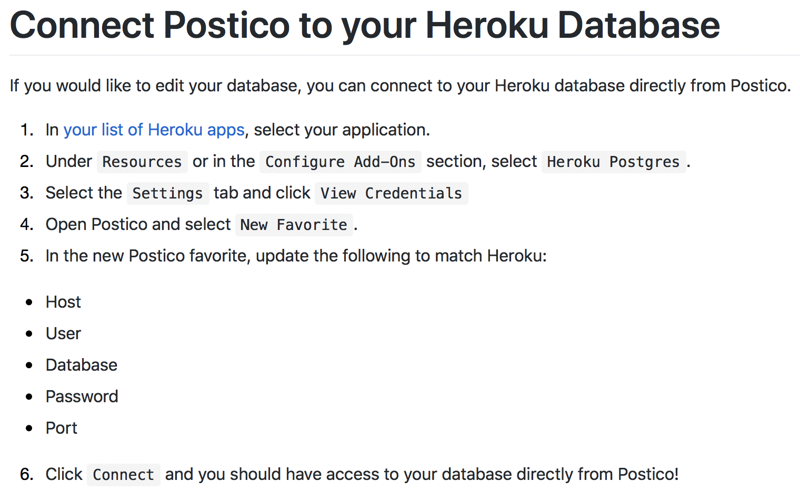

# Catalyst Learning Center tutorBuddy
Catalyst tutorBuddy is a web-first application built to streamline the paper-tracking process of a local math tutoring nonprofit organization. At its highest level, the app allows tutors to track, time, and edit session information. With separate permissions, admin users can visualize, filter, and export this data and also manage current tutors, pending tutor applications, as well as the information for partnering library locations.

## Built With
* React
* Redux
* Sagas
* Node.js
* Express.js
* PostgreSQL
* PG
* Cloudinary File Upload
* Chart.js
* Nodemailer
* Moment.js
* React-CSV
* React-Google-Recaptcha
* Passport
* Material Design
* Material Design Bootstrap
* NPM

## Getting Started
These instructions will get you a copy of the project up and running on your local machine for development and testing purposes. See deployment for notes on how to deploy the project on a live system.

### Installing
Steps to get the development environment running.

1. Download this project.
2. Run `npm install`
3. Create a `.env` file at the root of the project and paste this line into the file:
    ```
    SERVER_SESSION_SECRET=YOUR_API_KEY
    OAUTH_CLIENT_SECRET=YOUR_API_KEY
    OAUTH_REFRESH_TOKEN=YOUR_API_KEY
    OAUTH_ACCESS_TOKEN=YOUR_API_KEY
    CLOUDINARY_API_KEY=YOUR_API_KEY
    CLOUDINARY_API_SECRET=YOUR_API_KEY
    ```
    While you're in your new `.env` file, take the time to replace `superDuperSecret` with some long random string like `25POUbVtx6RKVNWszd9ERB9Bb6` to keep your application secure. Here's a site that can help you: [https://passwordsgenerator.net/](https://passwordsgenerator.net/). If you don't do this step, create a secret with less than eight characters, or leave it as `superDuperSecret`, you will get a warning.
    
4. Start postgres if not running already by using `brew services start postgresql`
5. Run `npm run server`
6. Run `npm run client`
7. Navigate to `localhost:3000`

## Screen Shots

#### Manage Tutors View

#### New Tutor Application View

#### Tutoring Sessions View

#### Data View, displaying 

### Completed Features
- [x] Two-level access: Admin and user-level 
- [x] Persistent navigation
- [x] Insert and export data
- [x] View and filter graphs and data tables
- [x] Start, time, and end tutoring sessions
- [x] Manage existing users (delete, edit, toggle admin access)
- [x] See pending applications
    - [x] Remove applications
    - [x] Accept an application and register the applicant as a new user / tutor
- [x] Manage exisiting tutoring locations
    - [x] Add a new tutoring location
    - [x] Edit an existing location
    - [x] Deactivate an existing location

### Next Steps
For future implementation:
- [ ] Filter pie chart by year
- [ ] A scheduling / calendar system that allows admin users to create shifts that tutor level users can see and assign themselves to.

## Deployment
### 0. If you don't have one already, sign up for an account on https://heroku.com 

### 1. Create a new Heroku project

### 2. Connect to the Herkoku Postgres database 

### 3. Commit Changes and Push them to Heroku

### 4. Connect Postico to your Heroku Database



## Authors
* Julia Balliet
* Kyra Crawford Calvert
* Travis Dunn
* Anthony James
* Abbey Janicek

## Acknowledgments
* Our client: Mai Yer Lee and Catalyst Learning Center
* Prime Digital Academy, particularly Christopher Black and Dane Smith 

