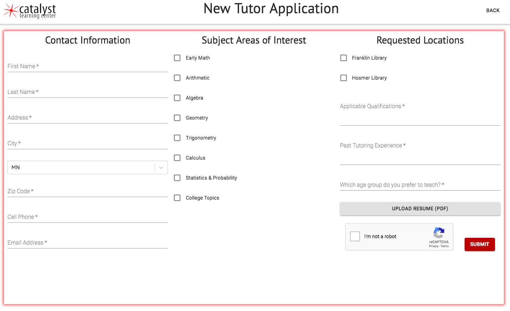

# Catalyst Learning Center tutorBuddy
Catalyst tutorBuddy is a web-first application built to streamline the paper-tracking process of a local math tutoring nonprofit organization. At its highest level, the app allows tutors to track, time, and edit session information. With separate permissions, admin users can visualize, filter, and export this data and also manage current tutors, pending tutor applications, as well as the information for partnering library locations.

Live Version: http://catalyst-learning-center.herokuapp.com

## Built With
* React
* Redux
* Sagas
* Node.js
* Express.js
* PostgreSQL
* PG
* Cloudinary File Upload
* Chart.js
* Nodemailer
* Moment.js
* React-CSV
* React-Google-Recaptcha
* Passport
* Material Design
* Material Design Bootstrap
* NPM

## Getting Started
These instructions will get you a copy of the project up and running on your local machine for development and testing purposes. See deployment for notes on how to deploy the project on a live system.

### Installing
Steps to get the development environment running.

1. Download this project.
2. Run `npm install`
3. Create a `.env` file at the root of the project and paste this line into the file:
    ```
    SERVER_SESSION_SECRET=YOUR_API_KEY
    OAUTH_CLIENT_SECRET=YOUR_API_KEY
    OAUTH_REFRESH_TOKEN=YOUR_API_KEY
    OAUTH_ACCESS_TOKEN=YOUR_API_KEY
    CLOUDINARY_API_KEY=YOUR_API_KEY
    CLOUDINARY_API_SECRET=YOUR_API_KEY
    ```
    While you're in your new `.env` file, take the time to replace `superDuperSecret` with some long random string like `25POUbVtx6RKVNWszd9ERB9Bb6` to keep your application secure. Here's a site that can help you: [https://passwordsgenerator.net/](https://passwordsgenerator.net/). If you don't do this step, create a secret with less than eight characters, or leave it as `superDuperSecret`, you will get a warning.
    
4. Start postgres if not running already by using `brew services start postgresql`
5. Run `npm run server`
6. Run `npm run client`
7. Navigate to `localhost:3000`

## Screen Shots
#### Manage Tutors View

After navigating to the ‘Manage Tutors’ view, admin users are able to:
* See a list of all existing users, both admin and tutor level, that are clickable to reveal an
expanded view that houses the tutor permissions, edit, and remove buttons, as well as additional tutor information
* Demote an existing admin to a tutor, or promote a tutor to an admin
* The ‘Make Admin’ button toggles to ‘Make Tutor’ if a user is already in the
admin role
* Edit an existing tutor’s contact information
* Remove an existing tutor from the database
* Add a new tutor to the system
#### New Tutor Application View

After completing the inputs and clicking ‘submit’ on the form:
* The form data is then collected and sent to the ‘Manage Applications’ portion of the
Admin view.
* Admins will be alerted via a pre-provided email that a new application exists within the
tutorBuddy app.
* This feature will be implemented using nodemailer, which allows emails to be
sent within the application.
#### Tutoring Sessions View

After selecting their tutoring location, tutors are directed to the Sessions view where they can start a new session, time active sessions, mark sessions complete, and edit completed sessions for the day.
##### Start a new session:
* When ‘New Session’ is clicked, a dialogue box appears and tutors are prompted to input the student’s first name, school, and grade level.
* Within the dialogue, when a tutor clicks “Begin Session”, an alert displays “You are about to begin a new tutoring session. Please confirm.”
** Users are then prompted to click ‘OK’ or ‘Cancel’.
* If the tutor clicks ‘OK’, start time is logged and the session information is moved to the
‘Active Sessions’ table
* If the tutor clicks ‘Cancel’, the dialogue box will go away and return the user to the main Sessions view.
##### Active sessions:
* Active sessions are shown in a table
* Each session is populated with a ‘Complete’ button
* When the ‘Complete’ button is clicked, the session end-time is logged and a dialogue
box appears
* Within the dialogue, a tutor will select the subject(s) on which they worked and then click
‘Complete session’
* The completed session is then moved into the ‘Completed Sessions’ table
##### Completed sessions:
* Completed sessions are shown in a table
* Each completed session is populated with an ‘Edit’ button
* When the ‘Edit’ button is clicked, input fields become editable ​inline
* Tutors can edit sessions within the timeframe of each shift, but not thereafter.
#### Data View

After login, admins are directed to a home page where they can immediately view tutor session data via a table, including: date, student name, school, grade, amount of time spent and on which subject. This view will also contain various data charts that cover how many schools and corresponding participants each hosting site (library) has reached. This information is filterable by tutoring location and school year.

From this landing page, an admin can switch pages via top bar navigation in the following ways:
* Start a tutoring session (this navigates to the Tutor Home view)
* The top navigation bar will persist on every admin view. Admins can easily exit
the Tutoring Session view by navigating to a different page.
* Manage existing tutors
* Manage tutoring locations
* Review new applicants
#### Database Structure


### Completed Features
- [x] Two-level access: Admin and user-level 
- [x] Persistent navigation
- [x] Insert and export data
- [x] View and filter graphs and data tables
- [x] Start, time, and end tutoring sessions
- [x] Manage existing users (delete, edit, toggle admin access)
- [x] See pending applications
    - [x] Remove applications
    - [x] Accept an application and register the applicant as a new user / tutor
- [x] Manage exisiting tutoring locations
    - [x] Add a new tutoring location
    - [x] Edit an existing location
    - [x] Deactivate an existing location

### Next Steps
For future implementation:
- [ ] Filter pie chart by year
- [ ] A scheduling / calendar system that allows admin users to create shifts that tutor level users can see and assign themselves to.

## Deployment
### 0. If you don't have one already, sign up for an account on https://heroku.com 

### 1. Create a new Heroku project

### 2. Connect to the Herkoku Postgres database 

### 3. Commit Changes and Push them to Heroku

### 4. Connect Postico to your Heroku Database


## Authors
* Julia Balliet
* Kyra Crawford Calvert
* Travis Dunn
* Anthony James
* Abbey Janicek

## Acknowledgments
* Our client: Mai Yer Lee and Catalyst Learning Center
* Prime Digital Academy, particularly Christopher Black and Dane Smith 

